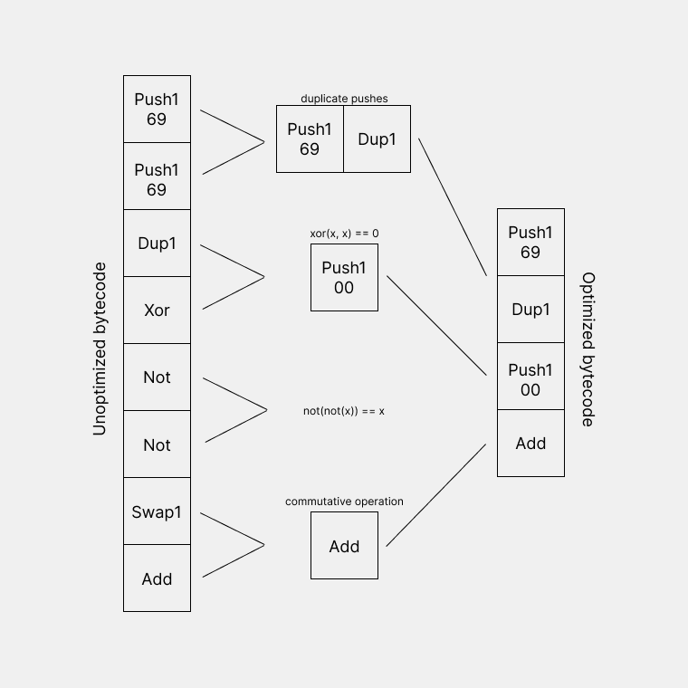

# Bytepeep •  

Bytecode in, optimized bytecode out.

### About

Bytepeep is a minimal bytecode peephole optimizer. Like any other peephole optimizer, it works by passing pairs of opcodes, peepholes, through a pattern matching algorithm to be checked against a set of rules and optimized if possible.

This is **not intended as a replacement for solidity's built-in optimizers**. Rather it should serve as a quick and easy tool for low-level smart contract development.

### Installation

**Install Rust & Cargo:**
`curl https://sh.rustup.rs -sSf | sh`

**Install bytepeep:**
`cargo install bytepeep`

**Run:**
`bytepeep <bytecode>`

### Todo

- [ ] Handle multi-variable rules, (stack/memory dependent)
- [ ] Reassign jumps
- [ ] Handle different inputs
  - [ ] Mnemonics
  - [ ] Huff
- [ ] Return tips along with optimized bytecode
